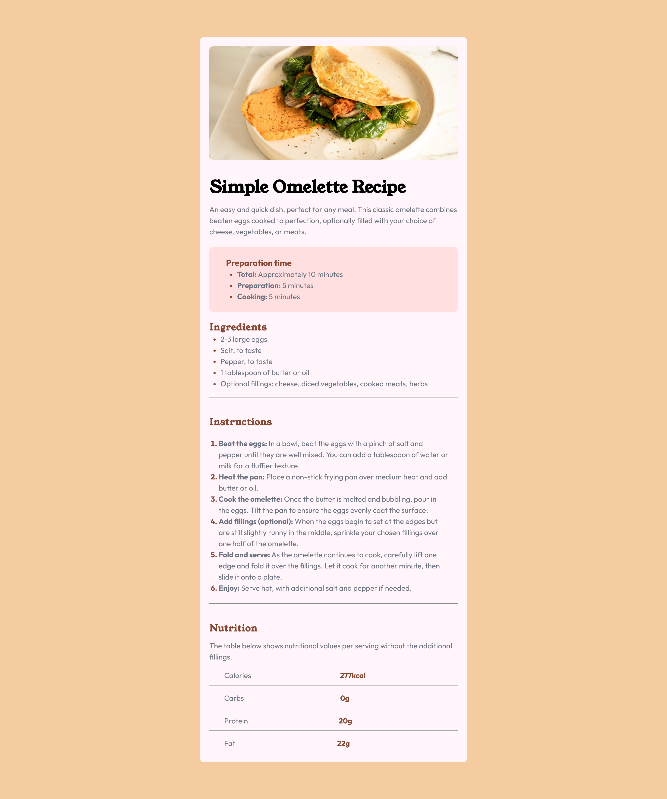
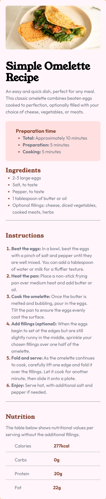

# Frontend Mentor - Recipe page solution

This is a solution to the [Recipe page challenge on Frontend Mentor](https://www.frontendmentor.io/challenges/recipe-page-KiTsR8QQKm). Frontend Mentor challenges help you improve your coding skills by building realistic projects. 

## Table of contents

- [Overview](#overview)
  - [The challenge](#the-challenge)
  - [Screenshot](#screenshot)
  - [Links](#links)
- [My process](#my-process)
  - [Built with](#built-with)  
- [Author](#author)

## Overview

### Screenshot

#### Desktop Version

#### Mobile Version

### Links

- Solution URL: [Add solution URL here](https://github.com/terryyufei/frontend_mentor-4/tree/main/recipe-page-main)
- Live Site URL: [Add live site URL here](https://recipe-page-orpin.vercel.app/)

## My process

### Built with

- Semantic HTML5 markup
- CSS custom properties
- Flexbox
- TailwindCSS
- Mobile-first workflow

## Author

- Website - [Portfolio](https://portfolio-tau-two-84.vercel.app/)
- Frontend Mentor - [@terryyufei](https://www.frontendmentor.io/profile/terryyufei)
- Twitter - [@Mssophia_](https://twitter.com/Mssophia_)
